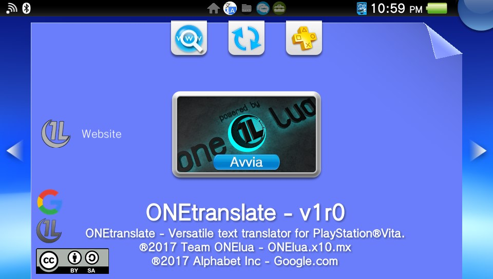
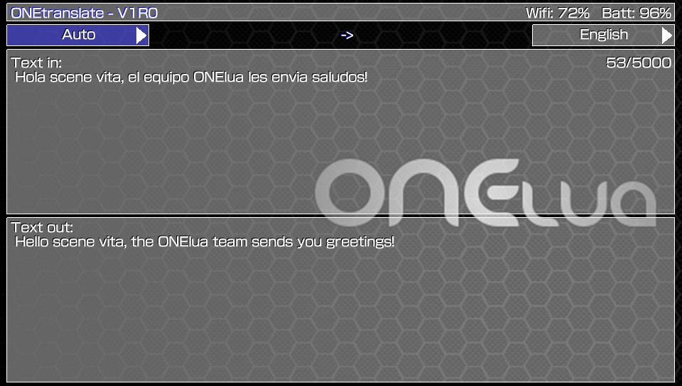

# ONEtranslate
Text translator for Play Station Vita.

-

-

ONEtranslate, is an application written in "ONElua" and supported by the well-known "Google translate" service to translate texts directly into the console, through a simple and friendly interface ...

Allows the translation of 11 languages in total:
  - "English", "Spanish", "Japanese", "German", "French", "Italian", "Dutch", "Portuguese", "Russian", "Korean", "Chinese".

It also allows automatic mode for the entrance, and thus detect the language that you are entering.

Controls:
- Left & Right Trigger: Switch between the output and input language selector.

- Left & Right D-Pad: Switch between the available languages in the selectors.

- Cross: Enter the keyboard and translate the entered text.
